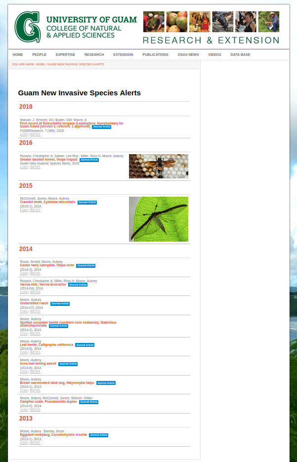

# Technical Notes

A library of fact sheets for insect pests recorded on Guam and elsewhere in Micronesia used to be available as downloadable PDFs on the University of Guam website. However, it appears that access to this content was removed during 2022 or 2023. This repository is intended to restore public access to the fact sheets.

Finding PDFs for many of the older series of fact sheets was relatively easy. But finding PDFs for *Guam New Invasive Species Alerts* was challenging. These PDFs are scientifically valuable because they document first island records for invasive species.

A version of the [*Alerts* web page](https://web.archive.org/web/20220119040011/https://cnas-re.uog.edu/guam-new-invasive-species-alerts/) was located using the [Wayback Machine](web.archive.org) which provides access to more than 945 billion archived web pages. 

The web page was accessed using [this link](https://web.archive.org/web/20220119040011/https://cnas-re.uog.edu/guam-new-invasive-species-alerts/).
Here's a screenshot of the page as it looked when it was archived at 2022-01-19 04:00:10 UTC:



This list of links to PDFs was built by clicking on the <u>links</u> button for each entry.

- Doleschalia tongana: https://f1000research.com/articles/7-366/v1
- Vespa tropica: https://github.com/aubreymoore/Vespa-tropica/raw/master/vespa_tropica.pdf
- Cydalima laticostalis: https://web.archive.org/web/20220119040011/http://guaminsects.net/anr/sites/default/files/cydalima-laticostalis(1)_0.pdf
- castor hairy caterpillar: https://web.archive.org/web/20220119040011/http://guaminsects.net/anr/sites/default/files/castor%20hairy%20caterpillar_0.pdf
- unidentified roach: https://web.archive.org/web/20220119040011/http://guaminsects.net/anr/sites/default/files/newpestroach.pdf
- spotted cucumber beetle: https://web.archive.org/web/20220119040011/http://guaminsects.net/anr/sites/default/files/spotted%20cucumber%20beetle.pdf
- Caligrapha californica: https://web.archive.org/web/20220119040011/http://guaminsects.net/anr/sites/default/files/calligrapha-californica(2).pdf
- Ixora leafmining weevil: https://web.archive.org/web/20220119040011/http://guaminsects.net/anr/sites/default/files/ixora-leafmining-weevil.pdf
- brown marmorated stink bug: https://web.archive.org/web/20220119040011/http://guaminsects.net/anr/sites/default/files/brownMarmoratedStinkBug.pdf
- camphor scale: https://web.archive.org/web/20220119040011/http://guaminsects.net/anr/sites/default/files/camphorscale2.pdf
- eggplant mealybug: https://web.archive.org/web/20220119040011/http://guaminsects.net/anr/sites/default/files/eggplantMealybug.pdf


# Retrieving PDFs from guaminsects.net

```
mkdir temp_anr_pdfs
cd temp_anr_pdfs
scp aubreymoore@guaminsects.net:~/guaminsects.net/anr/sites/default/files/*.pdf anr_pdfs
```

